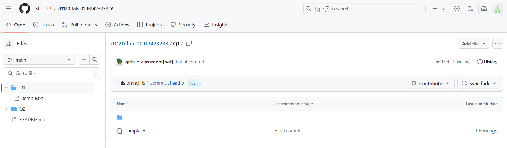

  <p align="center">
    
  </p>

## Part A – Java Setup

### JDK Download
1. **Visit Oracle Java Download Page**: [Oracle Java Download](https://www.oracle.com/java/technologies/downloads/)
   
3. **Select Java Version**: Select the latest Java Development Kit (JDK) version; in this example, JDK 22 is selected.
   
5. **Choose Your Operating System**: Click on the appropriate download link for your operating system (Windows, MacOS, Linux).
   
7. **Download the Installer**: For Windows, select the link for the ‘x64 Installer’ to begin downloading the file named: `jdk-22_windows-x64_bin.exe`
   
9. **Complete the Installation**: Once downloaded, run the `jdk-22_windows-x64_bin.exe` file and follow the on-screen instructions to install Java.

    
    
### Java Environment Home Path Setup

1.  **Locate Installation Directory**: Java installation default
    location is:

_C:\\Program Files\\Java\\jdk-22_

2.  **Open System Properties**:

    - **Open the Start Menu**: Click on the Start button or press the
      Windows key.

    - **Access Control Panel**: Type _Control Panel_ into the search
      box and click on it from the search results.

    - **System and Security**: In the Control Panel, click on '_System
      and Security_'.

    - **System**: Click on '_System_'.

    - **Advanced System Settings**: Click '_Advanced system settings_'
      on the right side.

        


3. **Environment Variables**: In the System Properties window under the ‘Advanced’ tab, click on the ‘Environment Variables’ button.

  <p align="center">
    
  </p>
  
5.  Select **JAVA_HOME**: In the System variables section, click '_New_'
    to create a new variable:

6.  Set **Variable name**: _JAVA_HOME_

7.  Set **Variable value**: the path to
    your Java installation e.g: _C:\\Program Files\\Java\\jdk-22_
    
<p align="center">
    
</p>
   
### Update Path Variable

1.  Select the **'_Path_'** variable under **'_System Variables_'** and click **'_Edit_'** button.

    <p align="center">
    
    </p>

3.  Click **'_New_'** and add: _%JAVA_HOME%\\bin_

4.  **Confirm Changes**: Click '_OK_' to apply the changes.

    <p align="center">
    
    </p>

**Verify The Installation (Java Version Check)**

1.  Open **Command Prompt**.

2.  Check Java Version:

- Type **java -version** in the command prompt.
- Press Enter.


## Part B -- Java Hello World Program

- **Create a Folder**:

  - In Desktop of your computer

  - Create a New Folder named: '**Lab 1**'

- **Open Notepad**: Start Notepad on your computer to begin writing
  your program.

- **Hello World Program:**

- In Notepad, write your first Hello World Java program as below:
  ```java
  public class Lab1Q1 {
      public static void main(String[] args) {
          System.out.println("Hello World! - ITxx xxx xxx");
      }
  }
  ```
    <p align="center">
    
    </p>

- Replace ‘ITxx xxx xxx’ in line 3 above code with your own Student ID.
  
- Save this file inside the ‘Lab 1’ folder as: `Lab1Q1.java` make sure to select ‘All files’ under ‘Save as type’.

    <p align="center">
    
    </p>

- **Open Command Prompt inside 'Lab 1' Folder:**


   - Inside 'Lab 1' folder, type **cmd** in the **_address bar_** of File Explorer and press Enter.

    <p align="center">
    
    </p>

   - This will open Command Prompt with the path set to the 'Lab 1' folder.

     

- **Compile the Program:**

   - Compile the Java program typing: `javac Lab1Q1.java`

     

- **Generated Byte Code (.class file):**

   - Verify that **Lab1Q1.class** appears in the directory, indicating
  successful compilation.

    <p align="center">
    
    </p>

- **Run the Program:**

   - In CMD, type: `java Lab1Q1` to run your program.
  
   - Confirm displayed output.

     <p align="center">
     
     </p>

   #### Finally, you need to upload the Java source file to GitHub Repository (next page).


## Part C – Lab Submission to GitHub


### GitHub Account Creation

### Step 1: Go to GitHub Website

- Open your web browser and navigate to: <https://github.com/>

**Step 2: Sign Up**

- Click 'Sign Up' button, typically located in the top right corner of
  the homepage.

- This will redirect you to the registration page.


### Step 3: Signup Details

- **Email Address:** Enter a your SLIIT email address.

- **Password:** Create a strong password, ideally at least 15
  characters long or at least 8 characters including a mix of letters,
  numbers, and symbols.

- **Username:** Enter your student ID as the username (e.g.,
  IT2423233). **Make sure to type IT in CAPS of your Student ID**.


### Step 4: Verify your Account

- Complete the CAPTCHA challenge to confirm that you are not a robot.

     <p align="center">
     
     </p>

### Step 5: Verify your Email address

- Check your email inbox for a verification email from GitHub.

- Click the provided link to verify your email address.


### Step 6: Sign in to the GitHub

- Enter your username and password

     <p align="center">
     
     </p>

### Step 7: Set up your Profile

- If you want, you can do the personalization for this account or you
  can skip this step by clicking the skip personalization.


### Step 8: Start using GitHub

- Your account is now ready. You can begin by creating repositories,
  participating in projects, and exploring the work of other GitHub
  users.


### Submitting Lab Source Files to GitHub

### Step 1: Open the Assignment Link

- Courseweb will provide the link to GitHub Classroom assignment
  submission page.

### Step 2: Authorize GitHub Classroom

- If it's your first-time using GitHub Classroom, you may be prompted to authorize GitHub Classroom to access your GitHub account.
- Click on the ‘Authorize GitHub Classroom’ button to proceed.
  
     <p align="center">
     
     </p>


### Step 3: Select the student IT Number in the list

   <p align="center">
   
   </p>

### Step 4: Accept the Assignment

- After Selecting the IT Number, you will be directed to the assignment acceptance page.

- Click on the '_Accept this assignment_' button.
  
- GitHub Classroom will start setting up your repository. This process may take a few moments.

   <p align="center">
   
   </p>
  

### Step 5: Access Your Repository

- The URL of your Git Repository will be in following format:

> *https://github.com/* **_organization_name/_** > **_assignment_name-username_**

-  **Bookmark or save this URL for easy access in future lab submissions**.

  

- Clicking the generated URL of your repository it will be redirected to your newly created GitHubrepository.

  


### Step 6: Access the Folder you want to submit the answer

- In the repository, locate the '_Q1_' folder by clicking on it. This
  will take you inside the folder.



### Step 7: Upload the Java Files

- Inside the 'Q1' folder, click on the '_Add file_' button located at
  the top right corner.

- Choose 'Upload files' from the dropdown menu.

- Drag and drop your **Lab1Q1.java** file or select '_choose your
  files_' link to navigate to your file saved in your computer.

- Once the file is selected, it will be uploaded to the GitHub
  Repository.


### Step 8: Commit the File

- After uploading the file, you will be directed to a '_Commit
  change_' section at the bottom of the page.

- Enter a commit message in the input box provided. Sample commit
  message could be something like: '**_Add Lab1Q1.java to Q1_**'.

- Ensure that you select '**_Commit directly to the main branch_**'
  option.

- Click on '_Commit changes_'.


### Step 9: Verify Submission

- After committing the changes, GitHub will return you to the folder
  view where you can see your newly uploaded **Lab1Q1.java** file
  inside the 'Q1' folder.

- Make sure the file is correctly placed and contains the appropriate
  content.

  
  <p align="center">
    
  </p>
