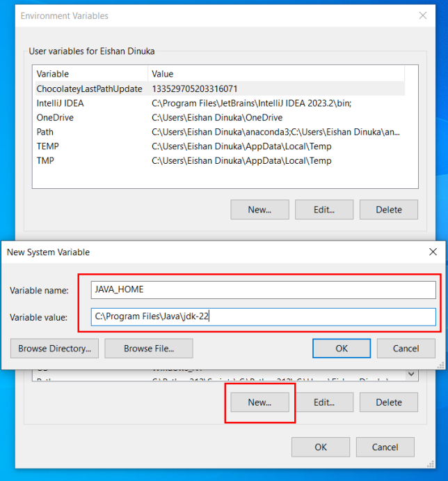

## Part A – Java Setup

### JDK Download
- **Visit Oracle Java Download Page**: [Oracle Java Download](https://www.oracle.com/java/technologies/downloads/)
- **Select Java Version**: Select the latest Java Development Kit (JDK) version; in this example, JDK 22 is selected.
- **Choose Your Operating System**: Click on the appropriate download link for your operating system (Windows, MacOS, Linux).
- **Download the Installer**: For Windows, select the link for the ‘x64 Installer’ to begin downloading the file named: `jdk-22_windows-x64_bin.exe`
- **Complete the Installation**: Once downloaded, run the `jdk-22_windows-x64_bin.exe` file and follow the on-screen instructions to install Java.

    {width="6.758333333333334in" height="3.198611111111111in"}

    
**Java Environment Home Path Setup**

1.  **Locate Installation Directory**: Java installation default
    location is:

_C:\\Program Files\\Java\\jdk-22_

2.  **Open System Properties**:

    - **Open the Start Menu**: Click on the Start button or press the
      Windows key.

    - **Access Control Panel**: Type _Control Panel_ into the search
      box and click on it from the search results.

    - **System and Security**: In the Control Panel, click on '_System
      and Security_'.

    - **System**: Click on '_System_'.

    - **Advanced System Settings**: Click '_Advanced system settings_'
      on the right side.

{width="6.409645669291338in"
height="2.6166721347331583in"}

3.  **Environment Variables:** In System Properties window, under
    '_Advanced_' tab click on the '_Environment Variables_' button.

{width="2.46875in"
height="2.6871161417322833in"}

4.  Select **JAVA_HOME**: In the System variables section, click '_New_'
    to create a new variable:

5.  Set **Variable name\***:\* _JAVA_HOME_

6.  {width="3.71875in"
    height="3.9993055555555554in"}Set **Variable value**: the path to
    your Java installation e.g: _C:\\Program Files\\Java\\jdk-22_

**Update Path Variable**

1.  {width="4.34375in"
    height="4.733333333333333in"}Select the '_Path_' variable under
    '_System Variables_' and click '_Edit_' button.

2.  Click '_New_' and add: _%JAVA_HOME%\\bin_

3.  **Confirm Changes**: Click '_OK_' to apply the changes.

{width="6.5in"
height="7.18125in"}

**Verify The Installation (Java Version Check)**

1.  Open **Command Prompt**.

2.  Check Java Version:

- Type **java -version** in the command prompt.

- {width="6.5in"
  height="1.5805555555555555in"}Press Enter.

**Part B -- Java Hello World Program**

- **Create a Folder**:

  - In Desktop of your computer

  - Create a New Folder named: '**Lab 1**'

- **Open Notepad**: Start Notepad on your computer to begin writing
  your program.

- **Hello World Program:**

```{=html}
<!-- -->
```

- In Notepad, write your first Hello World Java program as below:

> public class Lab1Q1 {
>
> public static void main(String\[\] args) {
>
> System.out.println(\"Hello World! - ITxx xxx xxx\");
>
> }
>
> }
>
> {width="4.885416666666667in"
> height="1.8020833333333333in"}

- Replace 'ITxx xxx xxx' in [line 3]{.underline} above code, with your
  own Student ID.

- Save this file inside 'Lab 1' folder as: **Lab1Q1.java** make sure
  to select 'All files' under 'Save as type'.

{width="5.897428915135608in"
height="4.341666666666667in"}

- **Open Command Prompt inside 'Lab 1' Folder:**

```{=html}
<!-- -->
```

- Inside 'Lab 1' folder, type **cmd** in the **_address bar_** of File
  Explorer and press Enter.

> {width="3.3541666666666665in"
> height="2.7144542869641293in"}

- This will open Command Prompt with the path set to the 'Lab 1'
  folder.

> {width="6.5in"
> height="1.461111111111111in"}

- **Compile the Program:**

```{=html}
<!-- -->
```

- Compile the Java program typing: **javac Lab1Q1.java**

> {width="4.73083552055993in"
> height="1.397516404199475in"}

- **Generated Byte Code (.class file):**

```{=html}
<!-- -->
```

- Verify that **Lab1Q1.class** appears in the directory, indicating
  successful compilation.

{width="5.276042213473316in"
height="3.147024278215223in"}

- **Run the Program:**

```{=html}
<!-- -->
```

- In CMD, type: **java Lab1Q1** to run your program.

- Confirm displayed output.

{width="4.414491469816273in"
height="2.3476257655293087in"}

Finally, you need to upload the Java source file to GitHub Repository
(next page).

**Part C -- Lab Submission to GitHub**

**GitHub Account Creation**

### Step 1: Go to GitHub Website

- Open your web browser and navigate to: <https://github.com/>

**Step 2: Sign Up**

- Click 'Sign Up' button, typically located in the top right corner of
  the homepage.

- This will redirect you to the registration page.

{width="6.934076990376203in"
height="3.5416666666666665in"}

### Step 3: Signup Details

- **Email Address:** Enter a your SLIIT email address.

- **Password:** Create a strong password, ideally at least 15
  characters long or at least 8 characters including a mix of letters,
  numbers, and symbols.

- **Username:** Enter your student ID as the username (e.g.,
  IT2423233). **Make sure to type IT in CAPS of your Student ID**.

{width="6.392361111111111in"
height="5.331944444444445in"}

### Step 4: Verify your Account

- Complete the CAPTCHA challenge to confirm that you are not a robot.

{width="2.821428258967629in"
height="2.534654418197725in"}

### Step 5: Verify your Email address

- Check your email inbox for a verification email from GitHub.

- Click the provided link to verify your email address.

{width="6.5in"
height="3.477777777777778in"}

### Step 6: Sign in to the GitHub

- Enter your username and password

{width="2.428472222222222in"
height="3.0236111111111112in"}

### Step 7: Set up your Profile

- If you want, you can do the personalization for this account or you
  can skip this step by clicking the skip personalization.

{width="6.5in"
height="3.0840277777777776in"}

### Step 8: Start using GitHub

- Your account is now ready. You can begin by creating repositories,
  participating in projects, and exploring the work of other GitHub
  users.

{width="6.253472222222222in"
height="3.0in"}

**Submitting Lab Source Files to GitHub**

### Step 1: Open the Assignment Link

- Courseweb will provide the link to GitHub Classroom assignment
  submission page.

### Step 2: Authorize GitHub Classroom

- If it's your first-time using GitHub Classroom, you may be prompted
  to authorize GitHub Classroom to access your GitHub account.

- {width="5.0472222222222225in"
  height="5.9743055555555555in"}Click on the '_Authorize GitHub
  Classroom_' button to proceed.

### Step 3: Select the student IT Number in the list

{width="5.701388888888889in"
height="3.7354166666666666in"}

### Step 4: Accept the Assignment

- After Selecting the IT Number, you will be directed to the
  assignment acceptance page.

- Click on the '_Accept this assignment_' button.

- {width="5.269444444444445in"
  height="2.8208333333333333in"}GitHub Classroom will start setting up
  your repository. This process may take a few moments.

### Step 5: Access Your Repository

- The URL of your Git Repository will be in following format:

> *https://github.com/* **_organization_name/_** > **_assignment_name-username_**

- {width="5.809027777777778in"
  height="2.6215277777777777in"}**Bookmark or save this URL for easy
  access in future lab submissions**.

- {width="6.989583333333333in"
  height="3.0118055555555556in"}Clicking the generated URL of your
  repository it will be redirected to your newly created GitHub
  repository

### Step 6: Access the Folder you want to submit the answer

- In the repository, locate the '_Q1_' folder by clicking on it. This
  will take you inside the folder.

{width="6.5in"
height="2.2383934820647418in"}

### Step 7: Upload the Java Files

- Inside the 'Q1' folder, click on the '_Add file_' button located at
  the top right corner.

- Choose 'Upload files' from the dropdown menu.

- Drag and drop your **Lab1Q1.java** file or select '_choose your
  files_' link to navigate to your file saved in your computer.

- Once the file is selected, it will be uploaded to the GitHub
  Repository.

{width="6.5in"
height="2.2381944444444444in"}

### Step 8: Commit the File

- After uploading the file, you will be directed to a '_Commit
  change_' section at the bottom of the page.

- Enter a commit message in the input box provided. Sample commit
  message could be something like: '**_Add Lab1Q1.java to Q1_**'.

- Ensure that you select '**_Commit directly to the main branch_**'
  option.

- Click on '_Commit changes_'.

{width="6.5in"
height="3.704861111111111in"}

### Step 9: Verify Submission

- After committing the changes, GitHub will return you to the folder
  view where you can see your newly uploaded **Lab1Q1.java** file
  inside the 'Q1' folder.

- Make sure the file is correctly placed and contains the appropriate
  content.
